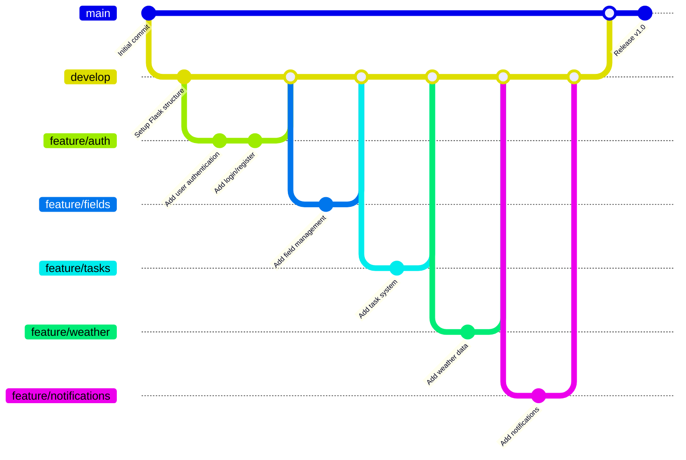

# AgriTechPro 

## Présentation du Projet

AgriTechPro est une application web innovante de gestion agricole développée pour aider les agriculteurs sénégalais à optimiser leurs activités agricoles. L'application combine des fonctionnalités de gestion des champs, de suivi des tâches et d'informations météorologiques pour une agriculture plus efficace et durable.

## Architecture du Projet

```
AgriTechPro/
├── app/                      # Application principale
│   ├── models/              # Modèles de données
│   │   ├── user.py         # Gestion des utilisateurs
│   │   ├── field.py        # Gestion des champs
│   │   ├── task.py         # Gestion des tâches
│   │   ├── notification.py # Système de notifications
│   │   └── weather_data.py # Données météorologiques
│   ├── routes/             # Routes de l'application
│   │   ├── main.py        # Routes principales
│   │   ├── auth.py        # Authentification
│   │   └── region_data.py # Données régionales
│   ├── templates/          # Templates Jinja2
│   │   ├── base.html      # Template de base
│   │   ├── dashboard.html # Tableau de bord
│   │   └── ...           # Autres templates
│   └── static/            # Fichiers statiques
├── migrations/             # Migrations de base de données
├── tests/                 # Tests unitaires et d'intégration
└── instance/              # Configuration et base de données
```

## Schéma des Branches Git



## Fonctionnalités Principales

1. **Authentification Sécurisée** 
   - Inscription et connexion des utilisateurs
   - Gestion des profils agriculteurs
   - Protection des données personnelles

2. **Gestion des Champs** 
   - Ajout et suivi des champs
   - Informations sur les cultures
   - Historique des activités

3. **Système de Tâches** 
   - Planification des activités agricoles
   - Rappels et notifications
   - Suivi de l'avancement

4. **Données Météorologiques** 
   - Prévisions météo par région
   - Alertes climatiques
   - Recommandations basées sur la météo

5. **Système de Notifications** 
   - Alertes en temps réel
   - Rappels de tâches
   - Informations météo importantes

## Stack Technique

- **Backend**: Python/Flask
- **Base de données**: SQLite/SQLAlchemy
- **Frontend**: HTML/CSS/JavaScript, Bootstrap
- **Authentification**: Flask-Login
- **Templates**: Jinja2
- **Tests**: Pytest

## Installation et Déploiement

1. Cloner le repository :
```bash
git clone https://github.com/FatoumataM-27/agritechpr.git
cd agritechpr
```

2. Créer un environnement virtuel :
```bash
python -m venv venv
source venv/bin/activate  # Linux/Mac
venv\Scripts\activate     # Windows
```

3. Installer les dépendances :
```bash
pip install -r requirements.txt
```

4. Configurer les variables d'environnement :
```bash
cp .env.example .env
# Éditer .env avec vos configurations
```

5. Initialiser la base de données :
```bash
flask db upgrade
python create_user.py  # Créer un utilisateur initial
```

6. Lancer l'application :
```bash
flask run
```

## Tests et Qualité du Code

- Tests unitaires avec Pytest
- Intégration continue avec GitHub Actions
- Couverture de code > 80%
- Respect des standards PEP 8

## Perspectives d'Évolution

1. **Phase 2 (Q2 2025)**
   - Intégration de l'IA pour les recommandations
   - Application mobile
   - Support multi-langues

2. **Phase 3 (Q4 2025)**
   - Marketplace agricole
   - Système de prévisions avancées
   - Intégration IoT pour les capteurs

## Contact

- **Développeur**: Fatoumata
- **Email**: fatoumata@gmail.com
- **GitHub**: [FatoumataM-27](https://github.com/FatoumataM-27)
